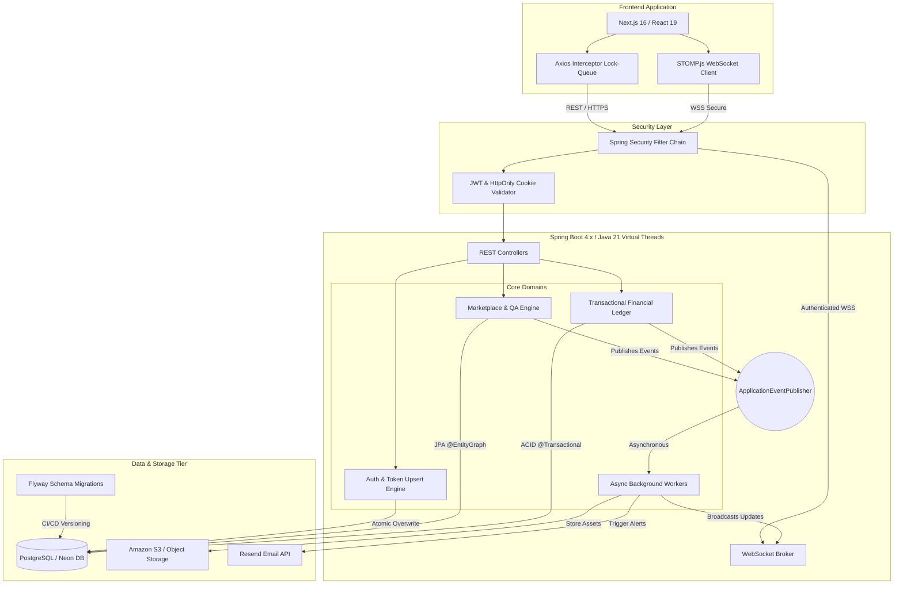

# VellumFlow: Enterprise Workflow Automation SaaS

*(Note: VellumFlow is a live, proprietary SaaS currently serving active clients in production. This repository serves as a technical whitepaper detailing the system architecture, design patterns, and engineering decisions. The source code is held in private repositories.)*

## 🏢 Executive Summary

VellumFlow is a distributed, multi-tenant workflow automation platform designed to manage end-to-end operations for international content consultancy groups. It centralizes strict multi-stage QA pipelines, a real-time WebSocket-driven project marketplace, and a cryptographically secure financial ledger for multi-currency specialist payouts.

---

---

## 🏗 Tech Stack & Infrastructure

The system operates on a decoupled architecture, prioritizing strict type safety, zero-trust security, and horizontal scalability.

### Backend (API Gateway & Core Engine)

* **Runtime:** Java 21 (Eclipse Temurin Alpine)
* **Framework:** Spring Boot 4.0.1
* **Database:** PostgreSQL (via Spring Data JPA)
* **Concurrency:** Java Virtual Threads enabled (`spring.threads.virtual.enabled=true`)
* **Security:** Spring Security 7.0+, JWT (HMAC-SHA256)
* **Mapping & Code Gen:** MapStruct 1.6.3, Lombok

### Frontend (Client Application)

* **Framework:** Next.js 16.1.4 (React 19.2.3)
* **Language:** Strict TypeScript
* **State & Fetching:** Axios 1.13.3 with custom interceptors
* **Real-time:** STOMP.js (`@stomp/stompjs`) for WebSockets
* **UI/UX:** TailwindCSS, Radix UI Primitives, Lucide Icons, Recharts 3.7.0

---

## ⚡ Core Domain Architectures

### 1. High-Concurrency Marketplace (Order Domain)

The platform handles a real-time project marketplace where specialists bid on and claim projects.

* **Event-Driven Decoupling:** Core business logic is strictly decoupled using Spring's `ApplicationEventPublisher`. Actions trigger immutable events (e.g., `OrderCreatedEvent`, `OrderClaimedEvent`, `OrderSubmittedEvent`) which are asynchronously processed by background workers to prevent blocking the main HTTP thread.
* **Real-Time Data Streams:** Integrated `SockJS` and STOMP over WebSockets to broadcast live order availability and status changes to connected clients, completely eliminating frontend HTTP polling.

### 2. Zero-Trust Security & Session Rotation (Auth Domain)

Security is implemented adhering to the OWASP Top 10, specifically tailored for a high-stakes financial environment.

* **Bulletproof JWT Lifecycle:** Utilizes short-lived Access Tokens passed via Authorization headers, paired with long-lived Refresh Tokens strictly negotiated via `HttpOnly`, `Secure`, `SameSite=None` cookies to mitigate XSS and CSRF attacks.
* **Atomic Upsert Token Rotation:** Engineered a custom `RefreshTokenService` that utilizes an atomic, in-place database Upsert pattern. This bypasses Hibernate flush-ordering race conditions and respects PostgreSQL unique constraints during concurrent session refreshes.
* **Frontend Queue Lock:** The React frontend utilizes a highly advanced Axios interceptor (`src/proxy.ts` / `src/lib/api.ts`) featuring an `isRefreshing` lock and a `failedQueue` to pause concurrent API requests while a background token refresh completes, ensuring seamless UX.

### 3. High-Integrity Financial Engine (Finance Domain)

To ensure absolute accuracy in specialist compensation, the system features a robust, transactional financial ledger.

* **Immutable Ledgers:** All system earnings, late fines, and payroll runs are recorded as immutable `Transaction` entities linked to version-controlled `Invoice` aggregates.
* **ACID Compliance:** Heavy reliance on Spring's `@Transactional` boundaries ensures that complex financial computations (like payroll generation and fine deductions) either commit entirely or rollback cleanly.

### 4. Advanced Observability & SRE Readiness

Designed for immediate site reliability intervention and automated orchestrator management.

* **Actuator Probes:** Exposed strict `/actuator/health/liveness` and `/readiness` probes for Docker/Kubernetes routing.
* **Distributed Tracing:** Integrated Micrometer Tracing (via Brave) to inject unique `[TraceID, SpanID]` tags into every SLF4J log line, seamlessly tracking isolated HTTP requests across asynchronous workers, email triggers (`ResendEmailService`), and WebSocket broadcasts.

---

## 📖 API Documentation & Contract
To explore the endpoints, request/response schemas, and JWT security requirements of the VellumFlow platform, view the official API documentation. 
*(Note: Live Swagger UI is disabled in production for security; the link below provides a static, read-only view of the OpenAPI specification).*

👉 **[View VellumFlow API Documentation on Postman](https://documenter.getpostman.com/view/51502914/2sBXcHhdoW)**

---

## 🤝 Let's Connect
I am a Senior Backend Specialist actively seeking challenging engineering roles. I would be thrilled to discuss the specific implementation details, trade-offs, and architectural decisions of VellumFlow in a technical interview.

* **LinkedIn:** [linkedin.com/in/kosgey-laban](https://linkedin.com/in/kosgey-laban)
* **Email:** [devynlab@gmail.com](mailto:devynlab@gmail.com), [kipkosgeilaban98@gmail.com](mailto:kipkosgeilaban98@gmail.com)
